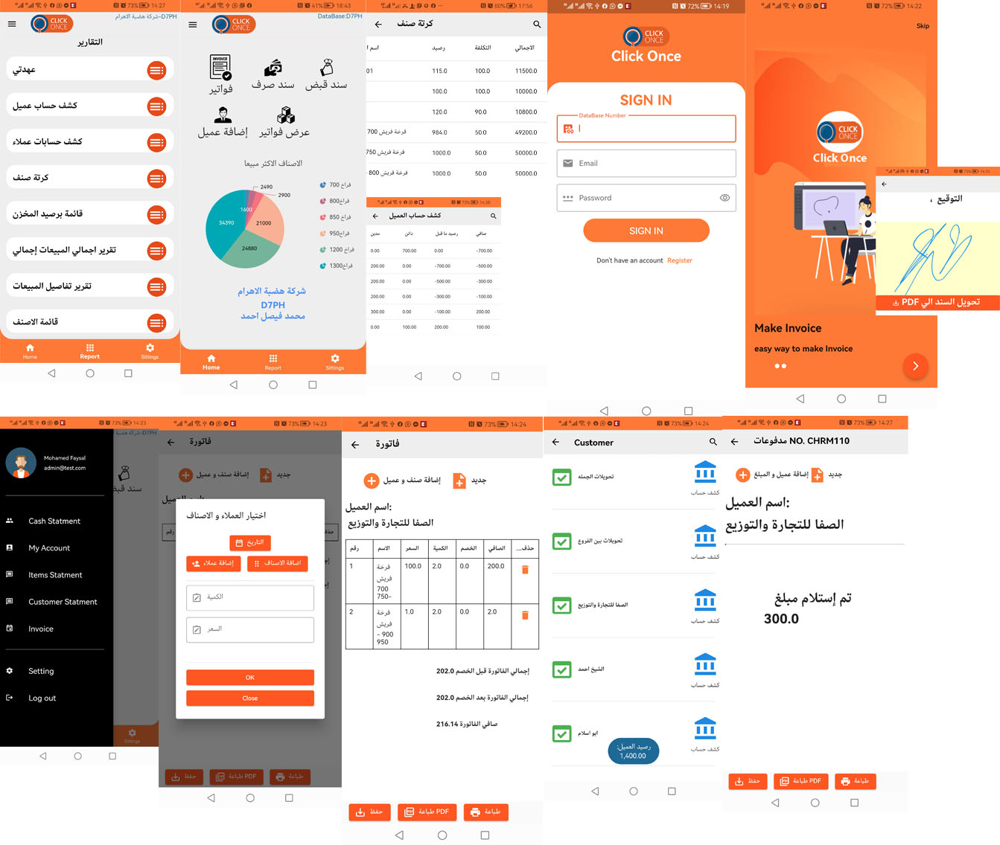

# clickonce

Click once app for sale man which help salesman to make invoice or clollect cash,  expenses , can sea cash statmen in report , know statmen of custmer to collect monye , make deal with new customer and add new customer in app which all thae data is part of ERP cloud Click once connect by API.

## Getting Started

This project is a starting point for a Flutter application.

A few resources to get you started if this is your first Flutter project:

- [Lab: Write your first Flutter app](https://docs.flutter.dev/get-started/codelab)
- [Cookbook: Useful Flutter samples](https://docs.flutter.dev/cookbook)

For help getting started with Flutter development, view the
[online documentation](https://docs.flutter.dev/), which offers tutorials,
samples, guidance on mobile development, and a full API reference.

